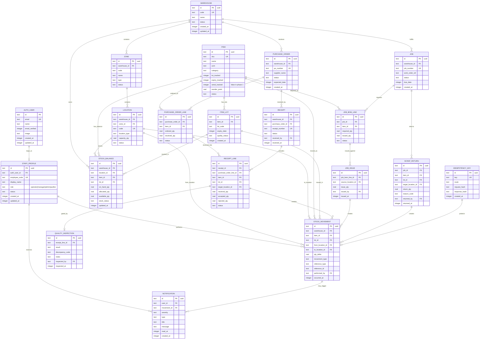

# ForgeFlow WMS Phase 1 Execution Plan

## Approved Decisions

| Area | Decision |
| --- | --- |
| Warehousing | Multi-warehouse from day one |
| Tracking | Lot + expiry tracking included; serial tracking deferred |
| Stock balances | Materialized `stock_balances` table plus immutable movement ledger |
| Roles | `operator`, `manager`, `admin`, `auditor` |
| Frontend deploy | Cloudflare Pages |
| Shared contracts | Add `packages/contracts` for Zod schemas, DTOs, enums, filters |
| Model selection rule | Use premium models for complex coding/architecture; mid-tier models for simpler tasks like code documentation |

## Monorepo Structure

```txt
forgeflow-wms/
  package.json
  pnpm-workspace.yaml
  pnpm-lock.yaml
  tsconfig.base.json
  eslint.config.js
  .env.example
  DESIGN.md
  AGENTS.md

  apps/
    web/
      package.json
      vite.config.ts
      components.json
      index.html
      src/
        main.tsx
        globals.css
        app/
          router.tsx
          providers.tsx
        layouts/
          auth-layout.tsx
          app-shell.tsx
        lib/
          api-client.ts
          auth-client.ts
          query-client.ts
          route-guards.tsx
        components/
          ui/
          shell/
            sidebar.tsx
            top-header.tsx
          data/
            industrial-data-table.tsx
            table-toolbar.tsx
            status-badge.tsx
        features/
          auth/
            login-page.tsx
          dashboard/
            stock-register-dashboard.tsx
            kpi-strip.tsx
            capacity-chart.tsx
            inventory-table.tsx
          inbound/
            po-receiving-page.tsx
            receipt-form.tsx
            inspection-gate-table.tsx
          outbound/
            job-allocation-page.tsx
            bom-issue-table.tsx
            scrap-return-panel.tsx
          movements/
            movement-ledger-page.tsx
            movement-filter-bar.tsx
          notifications/
            notifications-page.tsx
            alert-center.tsx

    api/
      package.json
      wrangler.jsonc
      tsconfig.json
      src/
        index.ts
        env.ts
        db.ts
        auth.ts
        middleware/
          auth-required.ts
          rbac.ts
          error-handler.ts
          validate.ts
        routes/
          health.ts
          auth.ts
          dashboard.ts
          inventory.ts
          warehouses.ts
          purchase-orders.ts
          receiving.ts
          jobs.ts
          movements.ts
          notifications.ts
        services/
          inventory-service.ts
          movement-service.ts
          receiving-service.ts
          allocation-service.ts
          notification-service.ts
        lib/
          http.ts
          pagination.ts
          idempotency.ts

  packages/
    db/
      package.json
      drizzle.config.ts
      src/
        index.ts
        client.ts
        relations.ts
        types.ts
        schema/
          auth.ts
          staff.ts
          warehouse.ts
          inventory.ts
          purchasing.ts
          jobs.ts
          movements.ts
          notifications.ts
          idempotency.ts
      migrations/

    contracts/
      package.json
      src/
        index.ts
        common.ts
        auth.ts
        roles.ts
        warehouse.ts
        inventory.ts
        purchasing.ts
        receiving.ts
        jobs.ts
        movements.ts
        notifications.ts
```

## Database ERD



## API Plan

Base path: `/api`.

| Domain | Endpoints |
| --- | --- |
| Health | `GET /health` |
| Auth | `ALL /auth/*`, `GET /me`, `POST /logout` |
| Dashboard | `GET /dashboard/kpis`, `GET /dashboard/capacity`, `GET /dashboard/inventory-summary` |
| Warehouses | `GET /warehouses`, `POST /warehouses`, `GET /warehouses/:id`, `GET /warehouses/:id/locations` |
| Inventory | `GET /inventory/items`, `POST /inventory/items`, `GET /inventory/items/:id`, `PATCH /inventory/items/:id` |
| Stock Balances | `GET /inventory/balances`, `GET /inventory/balances/:id` |
| Purchase Orders | `GET /purchase-orders`, `POST /purchase-orders`, `GET /purchase-orders/:id`, `PATCH /purchase-orders/:id` |
| Receiving | `POST /receipts`, `GET /receipts/:id`, `POST /receipts/:id/lines/:lineId/inspect`, `POST /receipts/:id/post` |
| Jobs | `GET /jobs`, `POST /jobs`, `GET /jobs/:id`, `PATCH /jobs/:id`, `GET /jobs/:id/bom` |
| Allocation | `POST /jobs/:id/issues/preview`, `POST /jobs/:id/issues`, `POST /jobs/:id/scrap-returns` |
| Movements | `GET /movements`, `GET /movements/:id`, `POST /movements/adjustments`, `POST /movements/transfers` |
| Notifications | `GET /notifications`, `PATCH /notifications/:id/read`, `PATCH /notifications/read-all` |

## API Conventions

| Concern | Decision |
| --- | --- |
| Validation | Zod schemas from `packages/contracts` |
| Auth | Better Auth mounted in Hono |
| RBAC | Enforced server-side with `operator`, `manager`, `admin`, `auditor` |
| Auditor | Read-only access |
| Pagination | `page`, `pageSize`, `sort`, `direction` |
| Filtering | Validated query objects per route |
| Errors | `{ error: { code, message, details } }` |
| Stock mutation safety | Idempotency key required for receiving, issuing, adjustments, transfers |
| Inventory invariant | Ledger row and stock balance update happen in the same transactional unit |
| Ledger policy | Append-only except privileged correction workflow |

## Frontend Routes

| Route | Screen |
| --- | --- |
| `/login` | Split-screen secure login |
| `/` | Redirect to `/dashboard` |
| `/dashboard` | Stock Register & Analytics |
| `/inbound/receiving` | Inbound PO Receiving |
| `/outbound/job-allocation` | Job Shop Allocation |
| `/movements` | Stock Movement Ledger |
| `/notifications` | System Notifications |
| `/inventory/items/:id` | Item detail |
| `/purchase-orders/:id` | PO detail |
| `/jobs/:id` | Job detail |

## Frontend Implementation Rules

| Area | Plan |
| --- | --- |
| Routing | React Router |
| Server state | TanStack Query |
| Shared types | `packages/contracts` |
| App shell | Fixed `260px` sidebar, `64px` header |
| UI components | shadcn/ui via MCP, then adapted to `DESIGN.md` |
| Styling | Tailwind CSS v4, `@theme inline`, `globals.css` semantic tokens |
| Visual density | 1px borders, 4px radius, `shadow-none`, compact table cells |
| Deployment | Cloudflare Pages with API Worker URL configured per environment |

## Build Phases

| Phase | Work | Verification |
| --- | --- | --- |
| 1 | Create PNPM workspace skeleton, root configs, package boundaries | `pnpm install`, workspace package resolution |
| 2 | Create `packages/contracts` with shared enums, DTOs, filters, pagination, Zod schemas | `pnpm typecheck` |
| 3 | Create `packages/db` with Drizzle schema, Better Auth tables, WMS tables, relations | `drizzle generate`, D1 migration flow, no `drizzle push` |
| 4 | Create Hono Worker foundation, D1 binding, env validation, error middleware | `pnpm --filter api typecheck` |
| 5 | Integrate Better Auth, session handling, CORS, Pages-to-Worker cookie strategy | Auth smoke test |
| 6 | Implement RBAC middleware and route protection | Role-based route tests |
| 7 | Implement movement ledger and stock balance services | Unit/service tests for receiving, issue, adjustment invariants |
| 8 | Implement inventory, warehouse, PO, receiving, job, movement, notification API routes | API smoke tests |
| 9 | Create Vite React app, Tailwind v4 globals, providers, router, query client | `pnpm --filter web build` |
| 10 | Install/adapt shadcn primitives through MCP for forms, tables, buttons, badges, dialogs | Visual/design inspection |
| 11 | Build secure split-screen login and protected industrial app shell | Playwright login/app-shell smoke test |
| 12 | Build dashboard with KPIs, capacity charts, high-density inventory table | Playwright smoke test |
| 13 | Build inbound PO receiving with inspection gating | Workflow smoke test |
| 14 | Build outbound job allocation with issue quantities and scrap returns | Workflow smoke test |
| 15 | Build movement ledger and notifications center | Filter/read-state smoke test |
| 16 | Final hardening: lint, typecheck, build, migrations, Playwright | `pnpm lint`, `pnpm typecheck`, `pnpm build`, Playwright |

## Implementation Notes

All non-Better Auth IDs will be random UUIDs. Serial tracking is explicitly out of scope for Phase 1, but the schema will avoid blocking future serial-level traceability.

Cloudflare Pages and Worker environments need separate preview and production variables for API URL, Better Auth base URL, cookie domain, and D1 bindings.

Inventory write operations must be service-mediated. Receiving, issuing, adjustments, scrap returns, and transfers must create immutable ledger records and update materialized stock balances in the same transactional unit.
